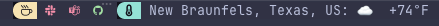

# tmux Integration

omniStatus is designed to live in a tmux status bar: a compact, colored glyph per platform that updates on its own, plus keybindings for changing your status without leaving the terminal.

## Status Line

Add `ost status --format tmux` to `status-right` (or `status-left`) in `~/.tmux.conf`:

```tmux
set -ag status-right "#(ost status --format tmux) "
```

This prints one colored glyph per enabled, readable platform on a single line - e.g. a green `S` (Slack, active), a yellow `T` (Teams, away), a red `G` (GitHub, busy). A platform that fails to respond renders as a dim `?` instead of breaking the line.

Here's a real status bar using it, second icon from the left, alongside other status-right segments (weather, hostname, clock):



**Use an absolute path** (e.g. `#(/usr/local/bin/ost status --format tmux)` or `#(~/dev/omniStatus/ost status --format tmux)`), not `./ost` - tmux runs status-line commands using the server's startup working directory, not the pane you're currently in, so a relative path can silently stop resolving if that directory ever changes (new session, server restart). If the glyphs ever go blank or "frozen," this is the first thing to check.

## Customizing Icons and Colors

Each platform's glyph and its three availability colors (green/yellow/red) are configurable via a `tmux:` block in that platform's config entry:

```yaml
slack:
  enabled: true
  token: "xoxp-..."
  tmux:
    icon: "S"              # any string: a letter, a word, a Nerd Font glyph
    color_green: "green"   # active/available
    color_yellow: "yellow" # away/transitional
    color_red: "red"       # busy/dnd/offline
```

Every field is optional - leaving any out falls back to a sensible default (the platform's initial letter, plain `"green"`/`"yellow"`/`"red"`). Colors accept anything tmux's `#[fg=...]` understands: a color name, a 256-color index (`"colour208"`), or (tmux 2.9+ with a truecolor terminal) a hex value (`"#ff8800"`). See the [Configuration section in the README](../README.md#configuration) for the full schema.

## Keybindings

Quick status changes bound to keys, so you never have to break focus to update your presence:

```tmux
bind-key -n M-a run-shell "ost set --status 'In tmux' --emoji ':computer:' --state active"
bind-key -n M-b run-shell "ost set --status 'Heads down' --emoji ':brain:' --state dnd"
bind-key -n M-w run-shell 'ost clear'
```

Use double quotes around the whole `run-shell` command and single quotes for the individual `--status`/`--emoji` values, not the other way around - tmux's own config-file parser (separate from your shell) mishandles nested double quotes inside a single-quoted `run-shell` argument.

`run-shell` fires the command in the background without blocking the UI, so these feel instant even though they're making live API calls.

## Multiple Panes / Sessions Polling at Once

If you have several tmux panes or sessions each rendering `status-right`, they'll all invoke `ost status --format tmux` independently. Enable caching in `config.yaml` so they share results instead of each hitting the live APIs separately:

```yaml
cache:
  enabled: true
  ttl: "10s"
```

This is a pure local read-cache colocated with your config file - it never affects `ost set`/`ost clear`, which always make live requests. tmux's own `status-interval` (default 15s) already limits how often it re-runs `#()` commands per pane, so caching mainly helps when multiple panes/sessions happen to poll close together in time, not within a single pane's own refresh loop.

## Scripting

For anything beyond the status bar itself - custom scripts, other status-line tools, dashboards - `ost status --format json` gives machine-readable output:

```bash
ost status --format json | jq -r '.slack.availability'
```

See `ost status --help` for the full format reference (`short`, `tmux`, `json`, and the default `full`).
